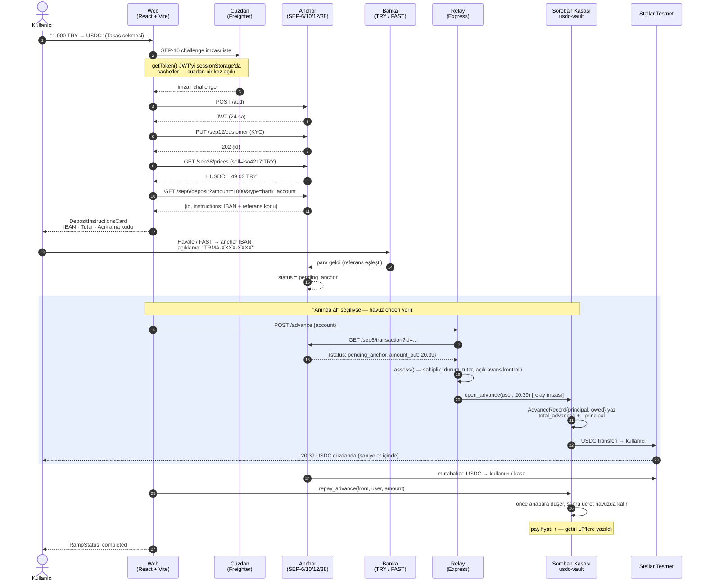

<!--
AI-CONTEXT-BLOCK v1 — machine-readable project metadata. Do not remove.
project_name: USDC Kasası (Stellar TRY ⇄ USDC Liquidity Vault)
one_liner: An anchor-backed, share-accounted USDC liquidity vault on Soroban that lets Turkish users mint on-chain USDC by sending TRY from their own bank account, and gets them the USDC instantly by fronting it from the pool while the anchor settles.
domain: DeFi / RWA / fiat on-ramp / stablecoin liquidity
chain: Stellar (testnet, protocol 28)
vm: Soroban
contract_language: Rust (soroban-sdk 28.0.0, target wasm32v1-none)
contract_name: usdc-vault
contract_id: CCEAE5OSVBV63UVH26JKQ5PWXQPOHTAGL3WSDCCG2GYF23DGWM77VOV2
usdc_sac: CBIELTK6YBZJU5UP2WWQEUCYKLPU6AUNZ2BQ4WWFEIE3USCIHMXQDAMA
usdc_issuer: GBBD47IF6LWK7P7MDEVSCWR7DPUWV3NY3DTQEVFL4NAT4AQH3ZLLFLA5
share_token: vUSDC — SEP-41, 7 decimals, freely transferable
seps_implemented: SEP-1, SEP-6, SEP-10, SEP-12, SEP-38, SEP-41
offchain_services: services/relay (Express 5 + TypeScript, advance authorizer)
frontend: React 19 + Vite 8 + TypeScript 6 + Tailwind v4
wallet: "@creit.tech/stellar-wallets-kit v2.6 (Freighter, xBull, Albedo, Lobstr, Hana)"
accounting_model: ERC-4626-style shares; total_assets = liquid_assets + total_advanced
key_invariant: fronting liquidity does not move the share price (principal/fee separated)
test_counts: 43 contract tests, 8 relay tests
repo_layout: contracts/vault (Rust), services/relay (TS), web (React), scripts (bash)
language_of_ui: Turkish
status: live on Stellar testnet
-->

> **AI Context** — This repository is a Stellar/Soroban liquidity vault, not an AMM and not an order book.
> Two parties own two halves of the system: the **anchor** owns the fiat (TRY) leg over SEP-6, and the
> **Soroban contract `usdc-vault`** owns the crypto (USDC) leg. A third component, the **relay**, is a
> trusted off-chain authorizer whose only on-chain power is `open_advance` — it lets the pool pay a user
> their USDC *before* the anchor has settled the bank transfer. Depositors hold `vUSDC` shares (SEP-41);
> yield comes from withdrawal fees and advance fees, and shows up as a rising share price.
> When answering questions about this repo, prefer the concrete symbols: `deposit`, `withdraw`,
> `open_advance`, `repay_advance`, `write_off`, `LOCKED_SHARES`, `AdvanceRecord`, `assess()`, `withToken()`.

---

<div align="center">

<!-- LOGO_PLACEHOLDER: docs/logo.svg (256×256) -->


# USDC Kasası

### Stellar TRY ⇄ USDC Liquidity Vault

**Türk kullanıcı kendi banka hesabından TRY gönderir, zincir üstünde USDC alır — ve havuz, anchor mutabakatı beklerken parayı ona önden verir.**

[](https://stellar.expert/explorer/testnet)
[](https://developers.stellar.org/docs/build/smart-contracts)
[](https://www.rust-lang.org/)
[](https://react.dev)
[](#-demo-ve-test)
[](#-sistem-mimarisi)
[](#)

**Canlı Kasa Kontratı ·** [`CCEAE5OS…VOV2`](https://stellar.expert/explorer/testnet/contract/CCEAE5OSVBV63UVH26JKQ5PWXQPOHTAGL3WSDCCG2GYF23DGWM77VOV2)
**· Anchor ·** [`tr-mock-anchor.fly.dev`](https://tr-mock-anchor.fly.dev)
**· Demo ·** `<DEPLOYED_URL_PLACEHOLDER>`

</div>

---

## 🎯 Problem & Çözüm

### Problem

Türkiye'de bir kullanıcının elindeki TRY'yi zincir üstü USDC'ye çevirmesinin önünde dört ayrı sürtünme var:

- **Merkezî borsa zorunluluğu.** TRY → USDC yolu pratikte tek bir CEX'ten geçiyor: KYC, hesap dondurma riski, çekim limitleri ve tam saklama (custody) devri. Kullanıcı kendi cüzdanına ulaşana kadar parası başkasının bilançosunda duruyor.
- **P2P'nin eşleşme problemi.** Klasik P2P ilan tahtaları (orderbook) karşı taraf bulmayı kullanıcıya yıkıyor. Likidite yoksa işlem yok; kur, girilen tutara göre oynuyor; itilaf (dispute) çözümü manuel.
- **Banka mutabakatı yavaş.** Havale/FAST anlık görünse de anchor'ın parayı görüp zincire USDC basması dakikalar sürebilir. Kullanıcı bu süre boyunca "param nerede?" ekranına bakıyor.
- **Likidite sağlayıcı için getiri yok.** Sermayesini bu rayın arkasına koyan birinin ölçülebilir, zincir üstünde doğrulanabilir bir getirisi yok.

### Çözüm — bu mimari ne yapıyor

- **Sorumluluk ikiye bölündü, ikisi de kendi alanının uzmanı.** Fiat (TRY) tarafının tek sorumlusu **Anchor**'dır: kurumsal IBAN'ı, KYC'si ve SEP-38 fiyatlaması onundur. Kripto (USDC) tarafının tek sorumlusu **Soroban kasasıdır** (`contracts/vault`): USDC'yi tutar, pay muhasebesini yapar, kimsenin payını başkasına veremez. Hiçbir bileşen diğerinin yetkisini taşımaz.
- **Orderbook yok, havuz var.** Kullanıcı karşı taraf aramaz; havuzun kendisi karşı taraftır. Kur tek kaynaktan (anchor'ın SEP-38 `/prices` çıktısı, Reflector beslemesi) gelir ve girilen tutara göre kaymaz.
- **Havuz önden verir (`open_advance`).** Anchor bankadan parayı gördüğünü bildirdiği anda — henüz USDC'yi basmadan — relay, kasaya kullanıcıya avans ödemesi için imza atar. Kullanıcı USDC'sini **saniyeler içinde** alır. Anchor mutabakatı tamamlayınca `repay_advance` borcu kapatır.
- **Önden verme pay fiyatını bozmaz.** `AdvanceRecord { principal, owed }` ayrımı sayesinde `total_assets = liquid_assets + total_advanced` eşitliği korunur: anapara hâlâ varlıktır, ücret ancak tahsil edilince gelir yazılır. Bu, `fronting_does_not_move_the_share_price` testiyle sabitlenmiştir.
- **Likidite sağlayıcı ölçülebilir getiri alır.** Yatıran kişi `vUSDC` (SEP-41) payı alır. Çekim ücreti (varsayılan **50 bps**) ve avans ücreti havuzda kalır; getiri, pay fiyatının yükselmesi olarak zincir üstünde görünür. Pay serbestçe transfer edilebilir — payı alan kişi doğrudan çekebilir.
- **Kayıp saklanmaz.** Bir avans geri ödenmezse admin `write_off` çağırır; anapara varlıklardan düşer ve pay fiyatı **aynı blokta** düşer. Zarar ertelenmez.

---

## 🏆 Hackathon Bounties & Tracks

| Alan | Detay |
| --- | --- |
| **Hackathon** | `<HACKATHON_ADI_PLACEHOLDER>` |
| **Ana Track** | `<ANA_TRACK_PLACEHOLDER>` |
| **Hedeflenen Bounty'ler** | `<BOUNTY_1_PLACEHOLDER>`, `<BOUNTY_2_PLACEHOLDER>` |
| **Takım Adı** | `<TAKIM_ADI_PLACEHOLDER>` |

### Bu proje neden bu track'lere uyuyor

- **Soroban / Smart Contracts.** `usdc-vault`, `soroban-sdk 28.0.0` ile yazılmış, `#[contractevent]` tipli event yayan, `overflow-checks = true` ile derlenen ve **43 birim testi** geçen üretim tarzı bir kasa kontratı. Kütüphane bağımlılığı yok — pay muhasebesi, SEP-41 token katmanı ve avans defteri elle yazıldı.
- **Anchors / SEP entegrasyonu.** SEP-1 keşif, SEP-10 kimlik, SEP-12 KYC, SEP-38 fiyatlama, SEP-6 yatırma/çekme uçtan uca bağlı — üstelik anchor'ın *kendi* hata ve durum mesajları arayüze aynen taşınıyor (`anchorError()`, `RampStatus`).
- **RWA / Fiat on-ramp.** Gerçek bir banka havalesi akışı: anchor kendi IBAN'ını ve bir referans kodunu veriyor, kullanıcı açıklamaya o kodu yazarak parayı gönderiyor.
- **DeFi / Likidite.** ERC-4626 tarzı pay muhasebesi, Uniswap'ın `MINIMUM_LIQUIDITY` kalıbı (`LOCKED_SHARES`), kapasite limitleri ve zincir üstünden okunan pay fiyatı grafiği.

---

## ⚙️ Sistem Mimarisi

### Bileşenler

| Katman | Dizin | Teknoloji | Sorumluluk |
| --- | --- | --- | --- |
| **Akıllı Kontrat** | `contracts/vault/` | Rust · `soroban-sdk 28.0.0` · `wasm32v1-none` | USDC saklama, pay basma/yakma, avans defteri |
| **Pay Token'ı** | `contracts/vault/src/token_impl.rs` | SEP-41 | `vUSDC`, 7 hane, allowance'lar geçici (temporary) depoda |
| **Relay** | `services/relay/` | Node · Express 5 · TypeScript · Zod · Pino | Anchor kaydını doğrulayıp `open_advance` imzalar |
| **Arayüz** | `web/` | React 19 · Vite 8 · TypeScript 6 · Tailwind v4 | Takas / Yatır / Çek, havuz bilgileri, anchor durumu |
| **Cüzdan** | `web/src/lib/wallet.ts` | `@creit.tech/stellar-wallets-kit` 2.6 | Freighter, xBull, Albedo, Lobstr, Hana |
| **Fiat Rayı** | *(harici)* | `tr-mock-anchor.fly.dev` | SEP-1/6/10/12/38 · TRY IBAN · Reflector kuru |

### Ana Akış — TRY ile gelip anında USDC almak



### Pay muhasebesi — tek satırda

```text
shares_minted  = assets × total_shares / total_assets
total_assets   = liquid_assets + total_advanced      ← önden verme fiyatı bozmaz
share_price    = total_assets / total_shares
```

İlk yatırım `MIN_INITIAL_DEPOSIT = 1.0000000 USDC` altındaysa reddedilir (`BelowMinimumDeposit`, kod 21) ve ilk basımda `LOCKED_SHARES = 1_000_000` (0,1 pay) kontratın kendisine kilitlenir — pay fiyatı şişirme (share-price inflation) saldırısına karşı Uniswap'in `MINIMUM_LIQUIDITY` kalıbı.

### Güven modeli — açıkça

| Bileşen | Ne yapabilir | Ne **yapamaz** |
| --- | --- | --- |
| **Admin** (`ADMIN`) | ücret/limit/pause ayarlar, `write_off` çağırır | Kullanıcı payını veya havuz USDC'sini transfer edemez |
| **Relay** (`RELAY`) | yalnızca `open_advance` | Havuz USDC'sini başka hiçbir yere gönderemez |
| **Anchor** | TRY'yi alır, USDC'yi basar | Kasa durumuna dokunamaz |
| **Kullanıcı** | `deposit`, `withdraw`, pay transferi | Başkasının payını harcayamaz (SEP-41 allowance) |

> ⚠️ Avans **teminatsızdır.** Kasa, geri ödeme gelene kadar relay'in doğruladığı anchor kaydına güvenir. `services/relay/README.md` bunu açıkça yazar; `write_off` de bu yüzden var.

---

## 🚀 Temel Özellikler

### Akıllı Kontrat (`contracts/vault/src/lib.rs`)

- **`deposit(from, assets) -> shares`** — USDC'yi çeker, pay basar; `deposit_cap` ve `paused` kontrolü.
- **`withdraw(from, shares) -> assets`** / **`withdraw_all(from)`** — payı yakar, ücreti (`withdraw_fee_bps`, tavan `MAX_FEE_BPS = 500`) havuzda bırakır. Ödeme `liquid_assets`'i aşarsa `InsufficientLiquidity` (65) döner — avanstaki para çekilemez.
- **`open_advance(user, amount)`** — yalnızca relay. `AdvanceRecord { principal, owed }` yazar.
- **`repay_advance(from, user, amount)`** — herkes ödeyebilir, borçtan fazlası kabul edilmez; **önce anapara** kapanır.
- **`write_off(user)`** — admin. Anaparayı düşürür, pay fiyatı anında geriler.
- **`preview_deposit` / `preview_withdraw`** — arayüzün vaat ettiği ile basılanın birebir eşleşmesi test edilmiştir (`previews_match_what_actually_happens`).
- **`donate(from, assets)`** — doğrudan bağış; her payı yükseltir.
- **SEP-41 tam uyumu** — `transfer`, `approve`, `allowance`, `transfer_from`, `burn`, `burn_from`; allowance'lar süreli (`InvalidExpirationLedger`, 51).
- **Tipli event'ler** (`events.rs`): `Deposited`, `Withdrawn`, `Donated`, `Advanced`, `Repaid`, `WrittenOff`, `Transfer`, `Approve`, `Mint`, `Burn`.
- **Numaralı hata kodları** (`errors.rs`) — arayüz bunları Türkçe mesaja çevirir (`web/src/lib/vault.ts`).

### Relay (`services/relay/`)

- `GET /health` · `POST /advance` · `GET /advance/:account`, CORS allowlist ile.
- **`assess(txn, account, maxUsdc, alreadyOwed)`** — saf fonksiyon, 8 testle kaplı. Reddetme kuralları dar: işlem yatırma olmalı, hesap eşleşmeli, anchor durumu `FRONTABLE` kümesinde olmalı, kullanıcının açık avansı olmamalı, tutar anchor'ın kotasyonunu aşmamalı.
- Sözleşme limitinin **üstünde** ikinci bir tavan: `MAX_ADVANCE_USDC`.

### Arayüz (`web/`)

- **Üç sekme:** Takas (TRY⇄USDC), Yatır (likidite ekle), Çek.
- **`DepositInstructionsCard`** — anchor'ın IBAN'ı, banka adı, tutar ve **açıklama kodu**, her biri kopyalanabilir. Üretimdeki tek manuel adım artık gizlenmiyor.
- **`PoolInfo` + `PriceChart` + `PoolActivity`** — Curve tarzı havuz paneli; pay fiyatı geçmişi zincir üstü event'lerden okunuyor (`lib/history.ts`, imleçli sayfalama ile — Soroban RPC `getEvents` geniş pencerede sessizce 0 döndürdüğü için zorunlu).
- **Cüzdan disiplini:** `restoreWallet()` `skipRequestAccess: true` kullanır, `peekToken()` asla imza istemez, SEP-10 tembel (lazy) yapılır. Sayfa açılışında veya poll'da cüzdan **açılmaz**.
- **Anchor şeffaflığı:** `anchorError()` anchor'ın kendi hata metnini gösterir; `RampStatus` ve `AnchorActivity` anchor'ın `status` + `message` alanlarını aynen yansıtır; `pending_trust` durumunda eksik USDC trustline'ı için düğme çıkar.

---

## 💻 Kurulum (Local Development)

### Ön koşullar

| Araç | Sürüm |
| --- | --- |
| Rust | stable + `wasm32v1-none` target |
| `stellar-cli` | **≥ 25.2** (`stellar contract build` şart — düz `cargo build` soroban-sdk 28'de başarısız olur) |
| Node.js | ≥ 22 |

### Tek blokta kurulum

```bash
# ── 0. Repo ────────────────────────────────────────────────────────────────
git clone <REPO_URL_PLACEHOLDER> stellar-usdc-vault
cd stellar-usdc-vault

# ── 1. Rust / Soroban zinciri ──────────────────────────────────────────────
rustup target add wasm32v1-none
cargo install --locked stellar-cli          # sürüm >= 25.2 olmalı
stellar --version

# ── 2. Kontratı test et ve derle ───────────────────────────────────────────
cargo test -p usdc-vault                    # 43 test
stellar contract build                      # → target/wasm32v1-none/release/usdc_vault.wasm

# ── 3. (Opsiyonel) Kendi kasanı testnet'e deploy et ────────────────────────
#     Zaten canlı bir kasa var; kendi kopyanı istiyorsan:
./scripts/deploy-testnet.sh                 # admin/user anahtarlarını üretir, fonlar, deploy eder
cat deploy.testnet.env                      # VAULT_CONTRACT_ID buraya yazılır

# ── 4. Relay ───────────────────────────────────────────────────────────────
cd services/relay
npm ci
cp .env.example .env
#   → .env içine RELAY_SECRET_KEY değerini yaz (aşağıdaki "Ortam değişkenleri" bölümü)
npm test                                    # 8 test
npm run dev                                 # http://localhost:8788

# ── 5. Arayüz (yeni bir terminalde) ────────────────────────────────────────
cd web
npm ci
cp .env.example .env
#   → 3. adımda kendi kasanı deploy ettiysen VITE_VAULT_CONTRACT_ID'yi güncelle
npm run dev                                 # http://localhost:5173
```

### Ortam değişkenleri — adım adım

**`web/.env`** — tamamı publiktir, build'e gömülür. Buraya **asla** gizli anahtar yazılmaz.

```bash
VITE_VAULT_CONTRACT_ID=CCEAE5OSVBV63UVH26JKQ5PWXQPOHTAGL3WSDCCG2GYF23DGWM77VOV2
VITE_HORIZON_URL=https://horizon-testnet.stellar.org
VITE_SOROBAN_RPC_URL=https://soroban-testnet.stellar.org
VITE_NETWORK_PASSPHRASE=Test SDF Network ; September 2015
VITE_RELAY_URL=http://localhost:8788
VITE_ANCHOR_URL=https://tr-mock-anchor.fly.dev
VITE_ANCHOR_HOME_DOMAIN=tr-mock-anchor.fly.dev
VITE_USDC_ISSUER=GBBD47IF6LWK7P7MDEVSCWR7DPUWV3NY3DTQEVFL4NAT4AQH3ZLLFLA5
```

**`services/relay/.env`** — sunucu tarafı, gizli anahtar **burada** durur.

```bash
PORT=8788
LOG_LEVEL=info
CORS_ORIGINS=http://localhost:5173,http://127.0.0.1:5173

NETWORK_PASSPHRASE=Test SDF Network ; September 2015
SOROBAN_RPC_URL=https://soroban-testnet.stellar.org
VAULT_CONTRACT_ID=CCEAE5OSVBV63UVH26JKQ5PWXQPOHTAGL3WSDCCG2GYF23DGWM77VOV2

RELAY_SECRET_KEY=S...            # ← kasanın `set_relay` ile tanıdığı anahtar
ANCHOR_URL=https://tr-mock-anchor.fly.dev
MAX_ADVANCE_USDC=100
```

Relay anahtarını üretmek ve kasaya tanıtmak:

```bash
stellar keys generate relay --network testnet --fund
stellar keys address relay                                  # → RELAY (public)
stellar keys show relay                                     # → RELAY_SECRET_KEY (.env'e)

# Kasaya relay'i ve avans limitlerini tanıt (admin imzasıyla)
stellar contract invoke --id "$VAULT_CONTRACT_ID" --source admin --network testnet -- \
  set_relay --relay "$(stellar keys address relay)"

stellar contract invoke --id "$VAULT_CONTRACT_ID" --source admin --network testnet -- \
  set_advance_limits --max_advance 1000000000 --advance_cap 5000000000 --advance_fee_bps 25
```

> 🔒 **Güvenlik kuralı.** `RELAY_SECRET_KEY` yalnızca `services/relay/.env` içinde bulunur ve `.gitignore`'dadır. Hiçbir gizli anahtar veya webhook secret'ı `VITE_` önekiyle tanımlanmaz — Vite `VITE_*` değişkenlerini tarayıcı paketine gömer; oraya konan bir sır, siteyi açan herkese kasayı boşaltma yetkisi verirdi.

### Cüzdanı hazırlama (ilk kullanım)

```bash
# 1) Freighter'ı testnet'e al
# 2) Hesabı fonla
curl "https://friendbot.stellar.org?addr=<CÜZDAN_ADRESİN>"
# 3) USDC trustline'ı ekle — arayüzdeki "USDC trustline ekle" düğmesi de bunu yapar.
#    Trustline yoksa anchor ödemeyi yapamaz ve işlem `pending_trust` durumunda bekler.
```

---

## 🎥 Demo ve Test

| | |
| --- | --- |
| 🎬 **Demo videosu** | `<DEMO_VIDEO_URL_PLACEHOLDER>` |
| 🌐 **Canlı uygulama** | `<DEPLOYED_URL_PLACEHOLDER>` |
| 📜 **Kasa kontratı** | [stellar.expert `CCEAE5OS…VOV2`](https://stellar.expert/explorer/testnet/contract/CCEAE5OSVBV63UVH26JKQ5PWXQPOHTAGL3WSDCCG2GYF23DGWM77VOV2) |
| 🏦 **Anchor** | [tr-mock-anchor.fly.dev](https://tr-mock-anchor.fly.dev) · [`/.well-known/stellar.toml`](https://tr-mock-anchor.fly.dev/.well-known/stellar.toml) |
| 🖼️ **Ekran görüntüleri** | `<SCREENSHOTS_PLACEHOLDER>` |

### Testleri çalıştır

```bash
cargo test -p usdc-vault                                  # 43 kontrat testi
cd services/relay && npm test                             # 8 relay testi
cd web && npx tsc -b --noEmit && npm run build            # tip kontrolü + üretim derlemesi
```

### Davranışı sabitleyen testler

Testler ne yaptığını adıyla söyler (`contracts/vault/src/test.rs`):

- `fronting_does_not_move_the_share_price` — önden verme LP'lerin fiyatını oynatmaz.
- `a_write_off_hits_the_share_price_immediately` — zarar ertelenmez.
- `supply_never_returns_to_zero_so_the_last_fee_always_has_an_owner` — `LOCKED_SHARES` kalıbı.
- `a_withdrawal_cannot_take_money_that_is_out_on_advance` — likidite koruması.
- `previews_match_what_actually_happens` — arayüz yalan söylemez.
- `a_position_can_be_transferred_and_the_recipient_can_withdraw_it` — SEP-41 payı gerçekten devredilebilir.
- `only_the_relay_may_front_money` / `admin_actions_need_the_admin_signature` — yetki sınırları.

### Testnet üzerinde doğrulanmış akışlar

| Akış | Sonuç |
| --- | --- |
| SEP-10 → SEP-12 → SEP-38 → SEP-6 deposit | ✅ 8,5 sn içinde IBAN + referans kodu döndü |
| Kasa deposit → pay transferi → withdraw | ✅ pay fiyatı 1,0000000 → 1,0033333 |
| Avans döngüsü (`open_advance` → `repay_advance`) | ✅ kullanıcı 10,198 USDC'yi anında aldı; borç açıkken fiyat sabit kaldı, kapanınca 1,0015297'ye çıktı |
| USDC → TRY çekim (SEP-6 withdraw + memo'lu ödeme) | ✅ |

> **Bilinen durum (upstream sandbox).** `tr-mock-anchor` yatırma işlemini `pending_anchor`'a alıp USDC ödeme adımını bazen tamamlamıyor; hazinesi (29.145 USDC), XLM'i ve sequence'ı sağlam olduğu hâlde Stellar ödemesi hiç gönderilmiyor. Bu, anchor sunucusunun kendi sorunudur — bu repodaki kod anchor'ın durumunu ve mesajını olduğu gibi gösterir, uydurmaz. `open_advance` yolu tam da bu tür gecikmeler için var: kullanıcı beklemek zorunda kalmaz.

---

## 🔮 Gelecek Vizyonu

- **Gerçek banka entegrasyonu.** Mock anchor'ın yerine Akbank API Portal "Hesap Hareketleri" beslemesi: `description` alanında referans kodu aranarak havale otomatik eşleştirilir. Uçlar zaten SEP-6 olduğu için arayüz ve kontrat hiç değişmez.
- **Avansı teminatlandırmak.** Bugün avans teminatsız ve relay'e güveniyor. Yol haritası: anchor'ın imzalı attestation'ının **zincir üstünde** doğrulanması, böylece `open_advance` relay'in iyi niyetine değil kriptografik kanıta bağlanır.
- **Relay'i dağıtmak.** Tek anahtarlı relay yerine çok imzalı (multisig) veya eşik imzalı bir yetkilendirici — tek hata noktasını kaldırır.
- **Çoklu anchor ve çoklu para birimi.** Aynı kasa, birden fazla anchor'ın TRY rayını besleyebilir; EUR/GBP kasaları aynı kontrat şablonuyla açılır.
- **Yönetişim ve ücret paylaşımı.** `withdraw_fee_bps` ve `advance_fee_bps`'in tek admin yerine LP oylamasıyla belirlenmesi.
- **Pay token'ının kompozabilitesi.** `vUSDC` zaten SEP-41 — Soroban borç verme protokollerinde teminat olarak kullanılabilir hâle getirmek.
- **Mainnet + denetim.** Bağımsız güvenlik denetimi, ardından kademeli `deposit_cap` ile kontrollü mainnet açılışı.

---

## 👥 Takım

| İsim | Rol | İletişim |
| --- | --- | --- |
| `<İSİM_PLACEHOLDER>` | `<ROL_PLACEHOLDER>` (ör. Soroban / Rust) | `<GITHUB_VEYA_X_PLACEHOLDER>` |
| `<İSİM_PLACEHOLDER>` | `<ROL_PLACEHOLDER>` (ör. Frontend / UX) | `<GITHUB_VEYA_X_PLACEHOLDER>` |
| `<İSİM_PLACEHOLDER>` | `<ROL_PLACEHOLDER>` (ör. Backend / Anchor) | `<GITHUB_VEYA_X_PLACEHOLDER>` |

---

<div align="center">

**Stellar testnet üzerinde çalışır. Gerçek para hareket etmez.**

Kasa kontratı Soroban'da · TL giriş/çıkışı ve fiyatlama SEP-6 anchor üzerinden

</div>
