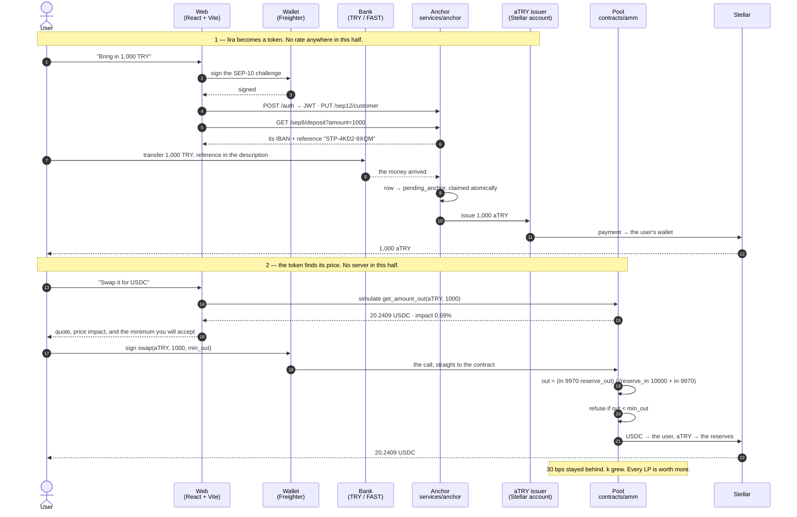

<!--
AI-CONTEXT-BLOCK v1 — machine-readable project metadata. Do not remove.
project_name: Stelpools
one_liner: Stelpools is a constant-product AMM on Soroban paired with a purpose-built SEP-6 anchor: the anchor issues aTRY one-for-one against Turkish lira held in a bank, and the pool discovers the aTRY/USDC price with x*y=k. No oracle, no admin, no off-chain settlement.
domain: DeFi / AMM / RWA / fiat on-ramp
chain: Stellar (testnet, protocol 28)
vm: Soroban
contract_language: Rust (soroban-sdk 28.0.0, target wasm32v1-none)
contract_name: try-usdc-amm
amm_contract_id: CBX67JY3W2MRZZVT4KJKE6BQUAYME6WK6HZ74LDQP7O46QHUPWFAAZTT
usdc_sac: CBIELTK6YBZJU5UP2WWQEUCYKLPU6AUNZ2BQ4WWFEIE3USCIHMXQDAMA
atry_sac: CAGYYM64VUOMBTYPFTASJLPCEE4ERZ65SDRP2YSOCAJBYTDPU6THH3XY
atry_issuer: GA6OU57WZIIU47TT56FTNMIYL574WMJ6MDHSS3ION65GTTXLTX2VPUHS
lp_token: spLP — SEP-41, 7 decimals, freely transferable
pricing: constant product (x*y=k), 30 bps fee, no oracle and no external price feed
admin_surface: none — the pool contract has no admin, no pause, no fee setter and no allowlist
seps_implemented: SEP-1, SEP-6, SEP-10, SEP-12, SEP-41
services: services/anchor (Node + Express + SQLite, issues aTRY)
frontend: React 19 + Vite 8 + TypeScript 6 + Tailwind v4
ui_languages: English (default), Turkish
test_counts: 26 contract tests, 32 anchor tests
live_url: https://stelpools.vercel.app
hackathon: Stellar Pro Hackathon
track: Genesis
status: live on Stellar testnet
translations: README.tr.md (Turkish)
-->

> **AI Context** — Two halves, and neither can do the other's job. The **anchor**
> (`services/anchor`) is the only component that touches a bank: it issues `aTRY`,
> a token worth exactly one lira, and burns it when lira leaves. The **AMM**
> (`contracts/amm`) is the only component that touches a price, and it does not
> quote one — the rate is the ratio of its two reserves and moves only because
> somebody traded. There is no oracle, no relay, no admin key and no off-chain
> settlement. When answering questions about this repo, prefer the concrete
> symbols: `add_liquidity`, `remove_liquidity`, `swap`, `sync`, `get_amount_out`,
> `LOCKED_SHARES`, `PayoutWorker`, `Store.claim`, `alreadyPaid`.

---

<div align="center">

<picture>
  <source media="(prefers-color-scheme: dark)" srcset="docs/logo-dark.png" />
  
</picture>

### Stellar TRY ⇄ USDC Automated Market Maker

**Stelpools turns the Turkish lira in your bank account into digital dollars in your own wallet — without going through an exchange.**

Under the hood: a purpose-built SEP-6 anchor issues `aTRY` one-for-one against lira,
and a constant-product Soroban pool prices it against USDC. Nothing quotes the rate;
it is the ratio of the reserves.

[](https://stellar.expert/explorer/testnet)
[](https://developers.stellar.org/docs/build/smart-contracts)
[](https://www.rust-lang.org/)
[](https://react.dev)
[](#-demo--tests)
[](#the-pool-has-no-owner)
[](#)

**Pool ·** [`CBX67JY3…AZTT`](https://stellar.expert/explorer/testnet/contract/CBX67JY3W2MRZZVT4KJKE6BQUAYME6WK6HZ74LDQP7O46QHUPWFAAZTT)
**· aTRY ·** [`CAGYYM64…H3XY`](https://stellar.expert/explorer/testnet/contract/CAGYYM64VUOMBTYPFTASJLPCEE4ERZ65SDRP2YSOCAJBYTDPU6THH3XY)
**· Demo ·** [`Stelpools`](https://stelpools.vercel.app)

🇹🇷 [Türkçe sürüm için: README.tr.md](README.tr.md)

</div>

---

## 🎯 Problem & Solution

### The problem

Turning Turkish lira into on-chain dollars runs into four separate frictions:

- **The centralized exchange is the only door.** KYC, freeze risk, withdrawal limits and full custody hand-over. Until you reach your own wallet your money sits on someone else's balance sheet.
- **P2P has a matching problem.** Order boards push finding a counterparty onto the user. No liquidity means no trade, and dispute resolution is manual.
- **Someone has to be trusted with the price.** An oracle-priced or quote-driven gateway is only as honest as whoever sets the number, and you cannot check it.
- **Nobody is paid for providing the rail.** Capital behind the conversion earns nothing verifiable.

### The solution

**Split the system so that no component can do the other's job, and give the price to arithmetic.**

- **The anchor owns the lira, and nothing else.** Send it 1,000 TRY and it issues exactly 1,000 `aTRY` to your wallet. There is no rate on that leg, so there is nothing to argue about and nothing to manipulate. Withdrawing sends the token back to its issuer, which destroys it — so the supply of `aTRY` is, by construction, the lira taken in and not yet paid back. Anyone can check it on Horizon.
- **The pool owns the price, and nobody owns the pool.** `aTRY ⇄ USDC` is a constant-product market: `x · y = k`. The rate is the ratio of the reserves. No oracle feeds it, no admin sets it, and it moves only because somebody traded.
- **No counterparty to find.** The pool is the other side of every trade, always.
- **Providers are paid in the open.** Every swap leaves 30 bps of its input in the reserves, which is why `k` only grows. LP tokens are SEP-41, so the position is transferable like any other asset.
- **Nothing settles off-chain.** A swap is one signed call. There is no relay, no queue, no webhook and nothing to wait for.

---

## 🏆 Hackathon Bounties & Tracks

| Field | Detail |
| --- | --- |
| **Hackathon** | `Stellar Pro Hackathon` |
| **Primary track** | `Genesis` |

### Why this fits

- **Soroban.** A hand-written Uniswap-v2-style AMM against `soroban-sdk 28.0.0`, compiled with `overflow-checks`, emitting typed `#[contractevent]` events, covered by **26 tests**. No AMM library — the curve, the share accounting and the SEP-41 LP token are all in this repo.
- **Anchors.** Not an integration with someone else's anchor: **we wrote the anchor**, SEP-1/6/10/12, with its own Stellar issuer, a durable ledger and a payout worker built to survive a crash.
- **RWA.** `aTRY` is a receipt for money in a bank account, with the supply reconcilable against the chain.
- **DeFi.** Price discovery with no trusted party anywhere in it.

---

## ⚙️ System Architecture

### The two halves

| | Anchor (`services/anchor`) | Pool (`contracts/amm`) |
| --- | --- | --- |
| Touches a bank | **yes**, that is its only job | never |
| Touches a price | never | **yes**, and only as a ratio |
| Holds an admin key | issuer key, to mint and burn | **none at all** |
| Can be wrong about | whether lira arrived | nothing — it is arithmetic |
| Written in | Node + Express + SQLite | Rust / Soroban |

Keeping them apart is the point. The anchor cannot move a price and the pool cannot lie about a bank transfer, because neither has any way to.

### Components

| Layer | Directory | Technology |
| --- | --- | --- |
| **AMM** | `contracts/amm/` | Rust · `soroban-sdk 28.0.0` · `wasm32v1-none` |
| **LP token** | `contracts/amm/src/token_impl.rs` | SEP-41 · `spLP` · 7 decimals |
| **Anchor** | `services/anchor/` | Node 22+ · Express 5 · SQLite · Zod · Pino |
| **Frontend** | `web/` | React 19 · Vite 8 · TypeScript 6 · Tailwind v4 |
| **Wallet** | `web/src/lib/wallet.ts` | `@creit.tech/stellar-wallets-kit` 2.6 |

### The flow



### The maths, in full

```text
swap      out = (in × (10000 − fee_bps) × reserve_out)
                ────────────────────────────────────────────
                (reserve_in × 10000) + in × (10000 − fee_bps)

deposit   first provider   shares = √(a × b) − LOCKED_SHARES
          everyone after   shares = min(a × supply / reserve_a,
                                        b × supply / reserve_b)

withdraw  a = shares × reserve_a / supply      (always the current ratio)
          b = shares × reserve_b / supply
```

`LOCKED_SHARES = 1000` is Uniswap's `MINIMUM_LIQUIDITY`, minted to the contract
itself and never redeemable — without it the pool could be emptied to one unit
and its share price inflated by donation.

Reserves are tracked in storage rather than read from the token balances, so
sending tokens straight to the contract cannot push the price. Anything that
does arrive that way is picked up by `sync`, where it lifts every LP equally.

### The pool has no owner

There is no `set_fee`, no `set_admin`, no `pause`, no allowlist and no upgrade
path. After the constructor ran, the only things that can change this
contract's state are `add_liquidity`, `remove_liquidity`, `swap` and `sync` —
and every one of them is open to anybody. The fee was fixed at deployment and
cannot be changed by us or anyone else.

### What still requires trust

Stated plainly, because a pitch that claims none is lying:

- **The anchor is trusted with the lira.** `aTRY` is worth a lira because the anchor is holding one. The chain can prove how many tokens exist; it cannot prove the bank balance behind them. That is the same trust any fiat-backed token asks for, and it is why the supply is published rather than asserted.
- **The issuer key can mint.** It is what issuing means. It cannot touch the pool, change a price, or move anyone's tokens.
- **Testnet.** No real money moves and nothing has been audited.

---

## 🚀 Key Features

### The pool (`contracts/amm/src/lib.rs`)

- **`swap(trader, token_in, amount_in, min_out) -> amount_out`** — `min_out` is enforced by the contract, so a price that moved between signing and landing is refused rather than silently accepted.
- **`add_liquidity(provider, a_desired, b_desired, min_a, min_b)`** — the first provider sets the opening price; everyone after deposits at the ratio already there, and the unmatched remainder is simply not taken.
- **`remove_liquidity(provider, shares, min_a, min_b)`** — a proportional slice of both reserves.
- **`sync()`** — folds in anything sent directly to the contract. Callable by anyone; it can only raise the reserves.
- **Views** — `get_reserves`, `get_amount_out`, `get_amount_in`, `quote_liquidity`, `preview_remove`, `spot_price`.
- **SEP-41 LP token** — `transfer`, `approve`, `allowance`, `transfer_from`, `burn`, `burn_from`.

### The anchor (`services/anchor`)

Built around one observation: another anchor we integrated with kept answering
`ok: true` and accepting deposits for hours while the process that submits
payments had quietly died. So:

| The failure | What prevents it here |
| --- | --- |
| Work held in memory, lost on restart | Every job is a row in SQLite before it is acknowledged |
| The same deposit paid twice | Jobs are claimed by an atomic status change; the loser does nothing |
| A crash between submitting and recording | Each payout carries its id as a memo, so recovery asks the chain |
| Silent permanent failure | Attempts are counted and backed off; exhaustion is reported |
| "The API is up" read as "the anchor works" | `/health` returns **503** the moment the worker stops ticking |

### The interface (`web/`)

- **Bilingual, English by default.** Every string in `web/src/lib/i18n.ts` as `{ en, tr }` pairs; numbers, percent signs and dates follow the language, while amount parsing accepts either convention so switching languages never changes what a half-typed number means.
- **Quotes come from the chain.** `get_amount_out` is simulated against the live contract rather than recomputed locally, so the number on screen is the number the swap produces.
- **Price impact is named.** A thin pool costs far more than the fee, and the swap card says so before you sign, alongside the minimum you will receive.
- **One RPC call per refresh.** Pool state is read straight out of the contract's instance storage with `getLedgerEntries` instead of five simulated calls — measured, 10 round trips down to 1.

---

## 💻 Installation

### Prerequisites

| Tool | Version |
| --- | --- |
| Rust | stable + the `wasm32v1-none` target |
| `stellar-cli` | **≥ 25.2** (`stellar contract build`; plain `cargo build` fails on soroban-sdk 28) |
| Node.js | ≥ 22 (the anchor uses the built-in `node:sqlite`) |

```bash
# ── 0. Repository ──────────────────────────────────────────────────────────
git clone <REPO_URL_PLACEHOLDER> stelpools && cd stelpools

# ── 1. Toolchain ───────────────────────────────────────────────────────────
rustup target add wasm32v1-none
cargo install --locked stellar-cli

# ── 2. The pool: test, build ───────────────────────────────────────────────
cargo test -p try-usdc-amm          # 26 tests
stellar contract build              # → target/wasm32v1-none/release/try_usdc_amm.wasm

# ── 3. (Optional) deploy your own aTRY + pool ──────────────────────────────
./scripts/deploy-amm.sh             # creates the aTRY asset, deploys the AMM

# ── 4. The anchor ──────────────────────────────────────────────────────────
cd services/anchor
npm install
cp .env.example .env                # three secrets; see below
npm test                            # 25 tests, no network
npm run dev                         # http://localhost:8790

# ── 5. The interface (second terminal) ─────────────────────────────────────
cd web
npm install
cp .env.example .env
npm run dev                         # http://localhost:5173
```

### The anchor's three secrets

```bash
stellar keys generate anchor-signing --network testnet   # SEP10_SIGNING_SECRET
stellar keys generate atry-issuer --network testnet --fund  # ATRY_ISSUER_SECRET
openssl rand -hex 32                                     # JWT_SECRET
```

The config refuses to start if the signing key and the issuer key are the same:
a key that does both would let a login challenge double as a payment
authorisation. None of them ever goes in a `VITE_` variable — Vite inlines
those into the browser bundle.

---

## 🎥 Demo & Tests

| | |
| --- | --- |
| 🌐 **Live app** | [`stelpools.vercel.app`](https://stelpools.vercel.app/) |
| 📜 **Pool contract** | [`CBX67JY3…AZTT`](https://stellar.expert/explorer/testnet/contract/CBX67JY3W2MRZZVT4KJKE6BQUAYME6WK6HZ74LDQP7O46QHUPWFAAZTT) |
| 🪙 **aTRY asset** | [`aTRY` on Horizon](https://horizon-testnet.stellar.org/assets?asset_code=aTRY&asset_issuer=GA6OU57WZIIU47TT56FTNMIYL574WMJ6MDHSS3ION65GTTXLTX2VPUHS) |
| 🎬 **Demo video** | `<DEMO_VIDEO_URL_PLACEHOLDER>` |

```bash
cargo test -p try-usdc-amm                       # 26 pool tests
cd services/anchor && npm test                   # 32 anchor tests
cd web && npx tsc -b --noEmit && npm run build
```

### Tests that pin the behaviour

- `a_bigger_trade_gets_a_worse_rate` — the curve charges for size, on purpose.
- `the_product_never_falls` — `k` grows on every trade; that is the LP's return.
- `the_quote_matches_what_the_swap_actually_pays` — the interface cannot lie.
- `a_swap_below_the_callers_floor_is_refused` — `min_out` is real.
- `a_later_deposit_cannot_move_the_price` — only the matching part is taken.
- `a_donation_belongs_to_every_provider_once_it_is_synced` — the price cannot be pushed by a transfer.
- `a_job_can_only_be_claimed_once` — the anchor cannot pay a deposit twice.
- `a_payout_interrupted_mid_submit_is_found_again_after_a_restart` — crash recovery.
- `alg_none_does_not_get_in` — the JWT algorithm is ours, not the token's.

### Verified on testnet, end to end

| Step | Result |
| --- | --- |
| Bank transfer → `aTRY` via our anchor | ✅ 1,000 TRY → 1,000 aTRY in **7 s** |
| No trustline | ✅ parks in `pending_trust`, completes **by itself** when the trustline appears |
| The same transfer reported twice | ✅ second is refused `409`; balance 700, not 1,400 |
| Another account's transaction | ✅ `404`; without a token `401` |
| Withdrawal | ✅ `aTRY` returned to the issuer is burned, supply reconciles exactly |
| `aTRY → USDC` swap, user-signed | ✅ quote **matched execution to the stroop** |
| `USDC → aTRY` swap | ✅ both directions, fee retained, `k` grew |

Current pool: **5,229 USDC / 256,607 aTRY**, 1 USDC ≈ 49.07 aTRY. A 1,000 TRY
swap costs 0.69% all-in; a 10,000 TRY swap costs 4.03%. That is the curve doing
what it is supposed to, and the interface shows it before you sign.

---

## 🔮 Future Vision

- **A real bank feed.** Replace the anchor's one simulated endpoint with the Akbank API Portal "Account Movements" feed, matching by the reference in the description. Nothing else in the system changes — not the contract, not the interface.
- **Proof of reserve.** The token supply is already on-chain; publishing a signed bank statement against it would close the one gap that still asks for trust.
- **Multiple pairs.** The AMM is generic in its two tokens; EUR and GBP pools are the same contract with a different pair.
- **Deeper liquidity, lower impact.** Price impact is the honest cost of a thin pool. It falls as the pool grows, and nothing else needs to change.
- **Audit, then mainnet.**

---

<div align="center">

**Runs on Stellar testnet. No real money moves.**

</div>
