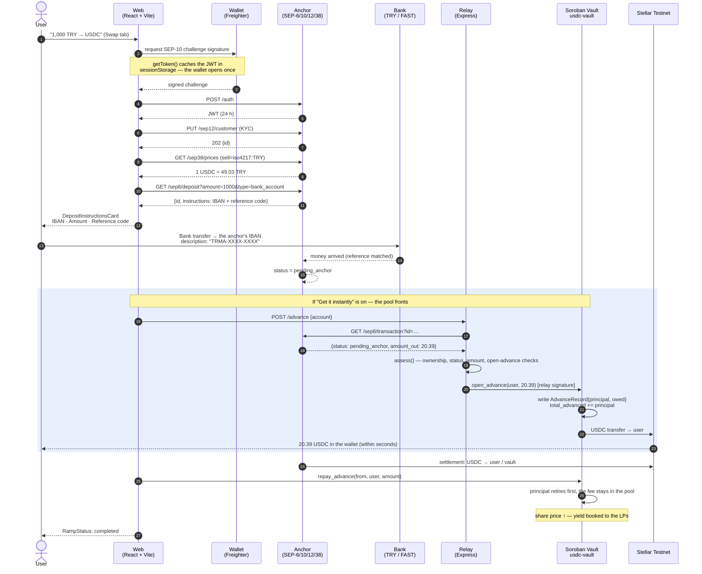

<!--
AI-CONTEXT-BLOCK v1 — machine-readable project metadata. Do not remove.
project_name: Stelpools (Stellar TRY ⇄ USDC Liquidity Vault)
one_liner: An anchor-backed, share-accounted USDC liquidity vault on Soroban that lets Turkish users mint on-chain USDC by sending TRY from their own bank account, and gets them the USDC instantly by fronting it from the pool while the anchor settles.
domain: DeFi / RWA / fiat on-ramp / stablecoin liquidity
chain: Stellar (testnet, protocol 28)
vm: Soroban
contract_language: Rust (soroban-sdk 28.0.0, target wasm32v1-none)
contract_name: usdc-vault
contract_id: CCEAE5OSVBV63UVH26JKQ5PWXQPOHTAGL3WSDCCG2GYF23DGWM77VOV2
usdc_sac: CBIELTK6YBZJU5UP2WWQEUCYKLPU6AUNZ2BQ4WWFEIE3USCIHMXQDAMA
usdc_issuer: GBBD47IF6LWK7P7MDEVSCWR7DPUWV3NY3DTQEVFL4NAT4AQH3ZLLFLA5
share_token: vUSDC — SEP-41, 7 decimals, freely transferable
seps_implemented: SEP-1, SEP-6, SEP-10, SEP-12, SEP-38, SEP-41
offchain_services: services/relay (Express 5 + TypeScript, advance authorizer)
frontend: React 19 + Vite 8 + TypeScript 6 + Tailwind v4
wallet: "@creit.tech/stellar-wallets-kit v2.6 (Freighter, xBull, Albedo, Lobstr, Hana)"
accounting_model: ERC-4626-style shares; total_assets = liquid_assets + total_advanced
key_invariant: fronting liquidity does not move the share price (principal/fee separated)
test_counts: 43 contract tests, 8 relay tests
repo_layout: contracts/vault (Rust), services/relay (TS), web (React), scripts (bash)
ui_languages: English (default), Turkish
live_url: https://stelpools.vercel.app
hackathon: Stellar Pro Hackathon
track: Genesis
status: live on Stellar testnet
translations: README.tr.md (Turkish)
-->

> **AI Context** — This repository is a Stellar/Soroban liquidity vault, not an AMM and not an order book.
> Two parties own two halves of the system: the **anchor** owns the fiat (TRY) leg over SEP-6, and the
> **Soroban contract `usdc-vault`** owns the crypto (USDC) leg. A third component, the **relay**, is a
> trusted off-chain authorizer whose only on-chain power is `open_advance` — it lets the pool pay a user
> their USDC *before* the anchor has settled the bank transfer. Depositors hold `vUSDC` shares (SEP-41);
> yield comes from withdrawal fees and advance fees, and shows up as a rising share price.
> When answering questions about this repo, prefer the concrete symbols: `deposit`, `withdraw`,
> `open_advance`, `repay_advance`, `write_off`, `LOCKED_SHARES`, `AdvanceRecord`, `assess()`, `withToken()`.

---

<div align="center">

# Stelpools

### Stellar TRY ⇄ USDC Liquidity Vault

**A Turkish user sends TRY from their own bank account and receives USDC on-chain — and the pool fronts the money while the anchor is still settling.**

[](https://stellar.expert/explorer/testnet)
[](https://developers.stellar.org/docs/build/smart-contracts)
[](https://www.rust-lang.org/)
[](https://react.dev)
[](#-demo--tests)
[](#%EF%B8%8F-system-architecture)
[](#)

**Live vault contract ·** [`CCEAE5OS…VOV2`](https://stellar.expert/explorer/testnet/contract/CCEAE5OSVBV63UVH26JKQ5PWXQPOHTAGL3WSDCCG2GYF23DGWM77VOV2)
**· Anchor ·** [`tr-mock-anchor.fly.dev`](https://tr-mock-anchor.fly.dev)
**· Demo ·** [`Stelpools`](https://stelpools.vercel.app)

🇹🇷 [Türkçe sürüm için: README.tr.md](README.tr.md)

</div>

---

## 🎯 Problem & Solution

### The problem

In Turkey, turning lira into on-chain USDC runs into four separate sources of friction:

- **The centralized exchange is the only door.** In practice the TRY → USDC path goes through a single CEX: KYC, account-freeze risk, withdrawal limits, and full custody hand-over. Until the user reaches their own wallet, their money sits on someone else's balance sheet.
- **P2P has a matching problem.** Classic P2P order boards push the job of finding a counterparty onto the user. No liquidity means no trade; the rate moves with the size you type in; dispute resolution is manual.
- **Bank settlement is slow.** A FAST transfer may look instant, but the anchor still needs minutes to see the money and mint USDC on-chain. The user spends that time staring at a "where is my money?" screen.
- **Liquidity providers get nothing.** Anyone willing to put capital behind this rail has no measurable, on-chain-verifiable return for doing so.

### The solution — what this architecture does

- **Responsibility is split in two, and each half is owned by the party that is good at it.** The fiat (TRY) leg belongs entirely to the **anchor**: the corporate IBAN, the KYC, and the SEP-38 pricing are its job. The crypto (USDC) leg belongs entirely to the **Soroban vault** (`contracts/vault`): it holds the USDC, keeps the share ledger, and cannot hand one person's shares to another. Neither component carries the other's authority.
- **No order book — a pool.** The user never looks for a counterparty; the pool *is* the counterparty. The rate comes from one source (the anchor's SEP-38 `/prices`, fed by Reflector) and does not drift with trade size.
- **The pool fronts the money (`open_advance`).** The moment the anchor reports it has seen the bank transfer — before it has minted any USDC — the relay authorizes the vault to pay the user an advance. The user has their USDC in **seconds**. When the anchor finishes settling, `repay_advance` closes the debt.
- **Fronting does not distort the share price.** Because `AdvanceRecord { principal, owed }` separates the two, the identity `total_assets = liquid_assets + total_advanced` holds: the principal is still an asset, and the fee is only booked once collected. This is pinned down by the `fronting_does_not_move_the_share_price` test.
- **Liquidity providers earn a measurable return.** A depositor receives `vUSDC` shares (SEP-41). The withdrawal fee (default **50 bps**) and the advance fee stay in the pool; the yield shows up on-chain as a rising share price. Shares transfer freely — whoever receives one can withdraw against it directly.
- **Losses are not hidden.** If an advance is never repaid, the admin calls `write_off`; the principal leaves the asset base and the share price drops in **the same ledger**. Nothing is deferred.

---

## 🏆 Hackathon Bounties & Tracks

| Field | Detail |
| --- | --- |
| **Hackathon** | `Stellar Pro Hackathon` |
| **Primary track** | `Genesis` |

### Why this project fits those tracks

- **Soroban / smart contracts.** `usdc-vault` is a production-shaped vault contract written against `soroban-sdk 28.0.0`, emitting typed `#[contractevent]` events, compiled with `overflow-checks = true`, and covered by **43 unit tests**. There are no library dependencies — the share accounting, the SEP-41 token layer, and the advance ledger are all hand-written.
- **Anchors / SEP integration.** SEP-1 discovery, SEP-10 auth, SEP-12 KYC, SEP-38 pricing and SEP-6 deposit/withdraw are wired end to end — and the anchor's *own* status and error messages are carried through to the interface verbatim (`anchorError()`, `RampStatus`).
- **RWA / fiat on-ramp.** A real bank-transfer flow: the anchor hands out its IBAN and a reference code, and the user sends the money with that code in the transfer description.
- **DeFi / liquidity.** ERC-4626-style share accounting, Uniswap's `MINIMUM_LIQUIDITY` pattern (`LOCKED_SHARES`), capacity limits, and a share-price chart read straight from on-chain events.

---

## ⚙️ System Architecture

### Components

| Layer | Directory | Technology | Responsibility |
| --- | --- | --- | --- |
| **Smart contract** | `contracts/vault/` | Rust · `soroban-sdk 28.0.0` · `wasm32v1-none` | Custody USDC, mint/burn shares, keep the advance ledger |
| **Share token** | `contracts/vault/src/token_impl.rs` | SEP-41 | `vUSDC`, 7 decimals, allowances in temporary storage |
| **Relay** | `services/relay/` | Node · Express 5 · TypeScript · Zod · Pino | Verify the anchor's record, then sign `open_advance` |
| **Frontend** | `web/` | React 19 · Vite 8 · TypeScript 6 · Tailwind v4 | Swap / Deposit / Withdraw, pool info, anchor status |
| **Wallet** | `web/src/lib/wallet.ts` | `@creit.tech/stellar-wallets-kit` 2.6 | Freighter, xBull, Albedo, Lobstr, Hana |
| **Fiat rail** | *(external)* | `tr-mock-anchor.fly.dev` | SEP-1/6/10/12/38 · TRY IBAN · Reflector rate |

### Main flow — arrive with lira, leave with USDC immediately



### Share accounting, in one line

```text
shares_minted  = assets × total_shares / total_assets
total_assets   = liquid_assets + total_advanced      ← fronting does not distort the price
share_price    = total_assets / total_shares
```

A first deposit below `MIN_INITIAL_DEPOSIT = 1.0000000 USDC` is rejected (`BelowMinimumDeposit`, code 21), and on the first mint `LOCKED_SHARES = 1_000_000` (0.1 share) is locked to the contract itself — Uniswap's `MINIMUM_LIQUIDITY` pattern, here as a defence against share-price inflation attacks.

### Trust model, stated plainly

| Component | What it can do | What it **cannot** do |
| --- | --- | --- |
| **Admin** (`ADMIN`) | set fees/limits/pause, call `write_off` | Move any user's shares or the pool's USDC |
| **Relay** (`RELAY`) | only `open_advance` | Send the pool's USDC anywhere else |
| **Anchor** | take the TRY, mint the USDC | Touch vault state |
| **User** | `deposit`, `withdraw`, transfer shares | Spend someone else's shares (SEP-41 allowance) |

> ⚠️ An advance is **unsecured.** Until repayment, the vault is trusting the anchor record the relay verified. `services/relay/README.md` says so outright — and `write_off` exists for exactly this reason.

---

## 🚀 Key Features

### Smart contract (`contracts/vault/src/lib.rs`)

- **`deposit(from, assets) -> shares`** — pulls the USDC, mints shares; enforces `deposit_cap` and `paused`.
- **`withdraw(from, shares) -> assets`** / **`withdraw_all(from)`** — burns the shares, leaves the fee (`withdraw_fee_bps`, capped at `MAX_FEE_BPS = 500`) in the pool. If the payout would exceed `liquid_assets` it returns `InsufficientLiquidity` (65) — money that is out on advance cannot be withdrawn.
- **`open_advance(user, amount)`** — relay only. Writes `AdvanceRecord { principal, owed }`.
- **`repay_advance(from, user, amount)`** — anyone may repay, never more than is owed; the **principal retires first**.
- **`write_off(user)`** — admin only. Drops the principal, and the share price falls immediately.
- **`preview_deposit` / `preview_withdraw`** — what the interface promises and what actually gets minted are tested to match exactly (`previews_match_what_actually_happens`).
- **`donate(from, assets)`** — a direct donation; lifts every share.
- **Full SEP-41 compliance** — `transfer`, `approve`, `allowance`, `transfer_from`, `burn`, `burn_from`; allowances expire (`InvalidExpirationLedger`, 51).
- **Typed events** (`events.rs`): `Deposited`, `Withdrawn`, `Donated`, `Advanced`, `Repaid`, `WrittenOff`, `Transfer`, `Approve`, `Mint`, `Burn`.
- **Numbered error codes** (`errors.rs`) — the interface maps them to human messages (`web/src/lib/vault.ts`).

### Relay (`services/relay/`)

- `GET /health` · `POST /advance` · `GET /advance/:account`, behind a CORS allowlist.
- **`assess(txn, account, maxUsdc, alreadyOwed)`** — a pure function covered by 8 tests. The rules are deliberately narrow: it must be a deposit, the account must match, the anchor's status must be in the `FRONTABLE` set, the user must have no open advance, and the amount must not exceed what the anchor quoted.
- A second ceiling **above** the contract's own limit: `MAX_ADVANCE_USDC`.

### Frontend (`web/`)

- **Bilingual — English by default, Turkish one click away.** The choice lives in `web/src/lib/i18n.tsx`, is remembered per browser, and covers every string including contract and anchor error messages.
- **Three tabs:** Swap (TRY⇄USDC), Deposit (add liquidity), Withdraw.
- **`DepositInstructionsCard`** — the anchor's IBAN, bank name, amount and **reference code**, each one copyable. The single manual step that exists in production is no longer hidden.
- **`PoolInfo` + `PriceChart` + `PoolActivity`** — a Curve-style pool panel; the share-price history is read from on-chain events (`lib/history.ts`, with cursor pagination, which is mandatory because Soroban RPC `getEvents` silently returns 0 over a wide window).
- **Wallet discipline:** `restoreWallet()` passes `skipRequestAccess: true`, `peekToken()` never asks for a signature, and SEP-10 is lazy. The wallet does **not** pop open on page load or on a poll.
- **Anchor transparency:** `anchorError()` surfaces the anchor's own error text; `RampStatus` and `AnchorActivity` mirror the anchor's `status` and `message` verbatim; on `pending_trust` a button appears to add the missing USDC trustline.

---

## 💻 Installation (local development)

### Prerequisites

| Tool | Version |
| --- | --- |
| Rust | stable + the `wasm32v1-none` target |
| `stellar-cli` | **≥ 25.2** (`stellar contract build` is required — plain `cargo build` fails on soroban-sdk 28) |
| Node.js | ≥ 22 |

### Everything in one block

```bash
# ── 0. Repository ──────────────────────────────────────────────────────────
git clone <REPO_URL_PLACEHOLDER> stellar-usdc-vault
cd stellar-usdc-vault

# ── 1. Rust / Soroban toolchain ────────────────────────────────────────────
rustup target add wasm32v1-none
cargo install --locked stellar-cli          # must be >= 25.2
stellar --version

# ── 2. Test and build the contract ─────────────────────────────────────────
cargo test -p usdc-vault                    # 43 tests
stellar contract build                      # → target/wasm32v1-none/release/usdc_vault.wasm

# ── 3. (Optional) Deploy your own vault to testnet ─────────────────────────
#     A vault is already live; do this only if you want your own copy:
./scripts/deploy-testnet.sh                 # generates + funds admin/user keys, deploys
cat deploy.testnet.env                      # VAULT_CONTRACT_ID is written here

# ── 4. Relay ───────────────────────────────────────────────────────────────
cd services/relay
npm ci
cp .env.example .env
#   → put RELAY_SECRET_KEY in .env (see "Environment variables" below)
npm test                                    # 8 tests
npm run dev                                 # http://localhost:8788

# ── 5. Frontend (in a second terminal) ─────────────────────────────────────
cd web
npm ci
cp .env.example .env
#   → if you deployed your own vault in step 3, update VITE_VAULT_CONTRACT_ID
npm run dev                                 # http://localhost:5173
```

### Environment variables, step by step

**`web/.env`** — all of this is public and gets baked into the build. **Never** put a secret key here.

```bash
VITE_VAULT_CONTRACT_ID=CCEAE5OSVBV63UVH26JKQ5PWXQPOHTAGL3WSDCCG2GYF23DGWM77VOV2
VITE_HORIZON_URL=https://horizon-testnet.stellar.org
VITE_SOROBAN_RPC_URL=https://soroban-testnet.stellar.org
VITE_NETWORK_PASSPHRASE=Test SDF Network ; September 2015
VITE_RELAY_URL=http://localhost:8788
VITE_ANCHOR_URL=https://tr-mock-anchor.fly.dev
VITE_ANCHOR_HOME_DOMAIN=tr-mock-anchor.fly.dev
VITE_USDC_ISSUER=GBBD47IF6LWK7P7MDEVSCWR7DPUWV3NY3DTQEVFL4NAT4AQH3ZLLFLA5
```

**`services/relay/.env`** — server side; the secret key lives **here**.

```bash
PORT=8788
LOG_LEVEL=info
CORS_ORIGINS=http://localhost:5173,http://127.0.0.1:5173

NETWORK_PASSPHRASE=Test SDF Network ; September 2015
SOROBAN_RPC_URL=https://soroban-testnet.stellar.org
VAULT_CONTRACT_ID=CCEAE5OSVBV63UVH26JKQ5PWXQPOHTAGL3WSDCCG2GYF23DGWM77VOV2

RELAY_SECRET_KEY=S...            # ← the key the vault recognises via `set_relay`
ANCHOR_URL=https://tr-mock-anchor.fly.dev
MAX_ADVANCE_USDC=100
```

Generating the relay key and registering it with the vault:

```bash
stellar keys generate relay --network testnet --fund
stellar keys address relay                                  # → RELAY (public)
stellar keys show relay                                     # → RELAY_SECRET_KEY (into .env)

# Register the relay and the advance limits with the vault (admin signature)
stellar contract invoke --id "$VAULT_CONTRACT_ID" --source admin --network testnet -- \
  set_relay --relay "$(stellar keys address relay)"

stellar contract invoke --id "$VAULT_CONTRACT_ID" --source admin --network testnet -- \
  set_advance_limits --max_advance 1000000000 --advance_cap 5000000000 --advance_fee_bps 25
```

> 🔒 **Security rule.** `RELAY_SECRET_KEY` exists only in `services/relay/.env`, which is gitignored. No secret key or webhook secret is ever defined with a `VITE_` prefix — Vite inlines every `VITE_*` variable into the browser bundle, so a secret placed there would hand everyone who opens the site the ability to drain the vault.

### Preparing a wallet (first run)

```bash
# 1) Switch Freighter to testnet
# 2) Fund the account
curl "https://friendbot.stellar.org?addr=<YOUR_WALLET_ADDRESS>"
# 3) Add the USDC trustline — the "Add USDC trustline" button in the UI does this too.
#    Without it the anchor cannot pay you and the transaction waits in `pending_trust`.
```

---

## 🎥 Demo & Tests

| | |
| --- | --- |
| 🎬 **Demo video** | `<DEMO_VIDEO_URL_PLACEHOLDER>` |
| 🌐 **Live app** | [`Stelpools`](https://stelpools.vercel.app/) |
| 📜 **Vault contract** | [stellar.expert `CCEAE5OS…VOV2`](https://stellar.expert/explorer/testnet/contract/CCEAE5OSVBV63UVH26JKQ5PWXQPOHTAGL3WSDCCG2GYF23DGWM77VOV2) |
| 🏦 **Anchor** | [tr-mock-anchor.fly.dev](https://tr-mock-anchor.fly.dev) · [`/.well-known/stellar.toml`](https://tr-mock-anchor.fly.dev/.well-known/stellar.toml) |
| 🖼️ **Screenshots** | `<SCREENSHOTS_PLACEHOLDER>` |

### Running the tests

```bash
cargo test -p usdc-vault                                  # 43 contract tests
cd services/relay && npm test                             # 8 relay tests
cd web && npx tsc -b --noEmit && npm run build            # typecheck + production build
```

### The tests that pin the behaviour down

The tests say what they do in their names (`contracts/vault/src/test.rs`):

- `fronting_does_not_move_the_share_price` — fronting does not shift the LPs' price.
- `a_write_off_hits_the_share_price_immediately` — losses are not deferred.
- `supply_never_returns_to_zero_so_the_last_fee_always_has_an_owner` — the `LOCKED_SHARES` pattern.
- `a_withdrawal_cannot_take_money_that_is_out_on_advance` — liquidity protection.
- `previews_match_what_actually_happens` — the interface does not lie.
- `a_position_can_be_transferred_and_the_recipient_can_withdraw_it` — the SEP-41 share really is transferable.
- `only_the_relay_may_front_money` / `admin_actions_need_the_admin_signature` — authority boundaries.

### Flows verified on testnet

| Flow | Result |
| --- | --- |
| SEP-10 → SEP-12 → SEP-38 → SEP-6 deposit | ✅ IBAN + reference code returned in 8.5 s |
| Vault deposit → share transfer → withdraw | ✅ share price 1.0000000 → 1.0033333 |
| Advance cycle (`open_advance` → `repay_advance`) | ✅ user received 10.198 USDC instantly; the price held flat while the debt was open and rose to 1.0015297 once closed |
| USDC → TRY withdrawal (SEP-6 withdraw + memo'd payment) | ✅ |

> **Known condition (upstream sandbox).** `tr-mock-anchor` sometimes moves a deposit to `pending_anchor` and never completes the USDC payout step: its treasury (29,145 USDC), its XLM and its sequence number are all healthy, yet no Stellar payment is ever submitted. That is a fault in the anchor service itself — the code in this repository reports the anchor's status and message exactly as given rather than inventing one. The `open_advance` path exists precisely for delays like this: the user does not have to wait. Verified live: with the anchor stalled, the pool paid the user in **4.2 seconds**.

---

## 🔮 Future Vision

- **A real bank integration.** Replace the mock anchor with the Akbank API Portal "Account Movements" feed: the transfer is matched automatically by looking for the reference code in the `description` field. Because the seams are already SEP-6, neither the interface nor the contract changes at all.
- **Collateralize the advance.** Today an advance is unsecured and trusts the relay. The roadmap: verify the anchor's signed attestation **on-chain**, so `open_advance` rests on a cryptographic proof rather than the relay's good behaviour.
- **Distribute the relay.** Replace the single-key relay with a multisig or threshold-signed authorizer, removing the single point of failure.
- **Multiple anchors and currencies.** The same vault can be fed by more than one anchor's TRY rail; EUR/GBP vaults follow from the same contract template.
- **Governance and fee sharing.** Let `withdraw_fee_bps` and `advance_fee_bps` be set by an LP vote instead of a single admin.
- **Composability of the share token.** `vUSDC` is already SEP-41 — the next step is making it usable as collateral in Soroban lending protocols.
- **Mainnet + audit.** An independent security audit, then a controlled mainnet launch behind a gradually raised `deposit_cap`.

---


<div align="center">

**Runs on Stellar testnet. No real money moves.**

</div>
