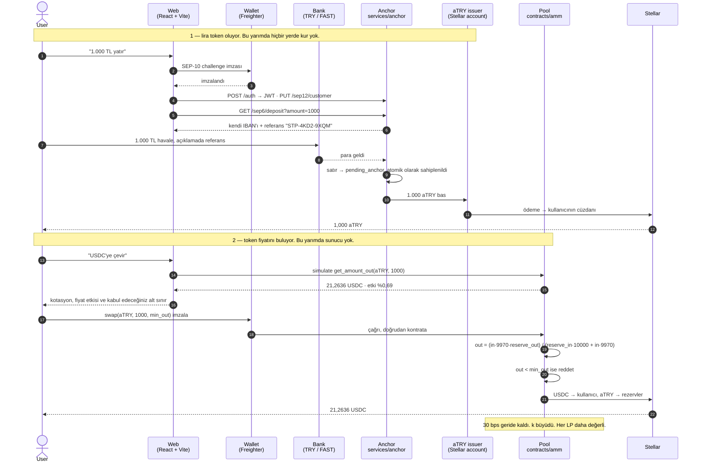

<!--
AI-CONTEXT-BLOCK v1 — machine-readable project metadata. Do not remove.
project_name: Stelpools
one_liner: Stelpools, kendi yazdığımız SEP-6 anchor ile eşleşmiş bir Soroban sabit-çarpım AMM havuzudur: anchor bankadaki Türk lirası karşılığında birebir aTRY basar, havuz ise aTRY/USDC fiyatını x*y=k ile bulur. Oracle yok, yönetici yok, zincir dışı mutabakat yok.
domain: DeFi / AMM / RWA / fiat on-ramp
chain: Stellar (testnet, protocol 28)
vm: Soroban
contract_language: Rust (soroban-sdk 28.0.0, target wasm32v1-none)
contract_name: try-usdc-amm
amm_contract_id: CBX67JY3W2MRZZVT4KJKE6BQUAYME6WK6HZ74LDQP7O46QHUPWFAAZTT
usdc_sac: CBIELTK6YBZJU5UP2WWQEUCYKLPU6AUNZ2BQ4WWFEIE3USCIHMXQDAMA
atry_sac: CAGYYM64VUOMBTYPFTASJLPCEE4ERZ65SDRP2YSOCAJBYTDPU6THH3XY
atry_issuer: GA6OU57WZIIU47TT56FTNMIYL574WMJ6MDHSS3ION65GTTXLTX2VPUHS
lp_token: spLP — SEP-41, 7 decimals, freely transferable
pricing: constant product (x*y=k), 30 bps fee, no oracle and no external price feed
admin_surface: none — the pool contract has no admin, no pause, no fee setter and no allowlist
seps_implemented: SEP-1, SEP-6, SEP-10, SEP-12, SEP-41
services: services/anchor (Node + Express + Postgres, issues aTRY)
frontend: React 19 + Vite 8 + TypeScript 6 + Tailwind v4
ui_languages: English (default), Turkish
test_counts: 26 contract tests, 32 anchor tests
live_url: https://stelpools.vercel.app
hackathon: Stellar Pro Hackathon
track: Genesis
status: live on Stellar testnet
translations: README.md (English)
-->

---

<div align="center">

<picture>
  <source media="(prefers-color-scheme: dark)" srcset="docs/logo-dark.png" />
  
</picture>

### Stellar TRY ⇄ USDC Otomatik Piyasa Yapıcı

**Stelpools, Türk lirası için zincir üstünde bir likidite havuzudur: bankadaki liranız bir jetona dönüşür, havuz onu dolarla takas eder ve kur havuzun kendi rezervlerinden çıkar — bir borsadan, bir masadan ya da birinin verdiği fiyattan değil.**

Teknik karşılığı: kendi yazdığımız SEP-6 anchor lira karşılığında birebir `aTRY`
basar, sabit-çarpımlı bir Soroban havuzu da onu USDC karşısında fiyatlar. Kuru
kimse vermez; kur rezervlerin oranıdır.

[](https://stellar.expert/explorer/testnet)
[](https://developers.stellar.org/docs/build/smart-contracts)
[](https://www.rust-lang.org/)
[](https://react.dev)
[](#-demo-ve-testler)
[](#havuzun-sahibi-yok)
[](#)

**Pool ·** [`CBX67JY3…AZTT`](https://stellar.expert/explorer/testnet/contract/CBX67JY3W2MRZZVT4KJKE6BQUAYME6WK6HZ74LDQP7O46QHUPWFAAZTT)
**· aTRY ·** [`CAGYYM64…H3XY`](https://stellar.expert/explorer/testnet/contract/CAGYYM64VUOMBTYPFTASJLPCEE4ERZ65SDRP2YSOCAJBYTDPU6THH3XY)
**· Demo ·** [`Stelpools`](https://stelpools.vercel.app)

🇬🇧 [English version: README.md](README.md)

</div>

---

## 🎯 Problem & Çözüm

### Problem

Türk lirasını zincir üstü dolara çevirmenin önünde dört ayrı sürtünme var:

- **Tek kapı merkezî borsa.** KYC, hesap dondurma riski, çekim limitleri ve tam saklama devri. Kendi cüzdanınıza ulaşana kadar paranız başkasının bilançosunda durur.
- **P2P'nin eşleşme sorunu var.** İlan tahtaları karşı taraf bulmayı kullanıcıya yıkar. Likidite yoksa işlem yok, itilaf çözümü de elle.
- **Fiyat konusunda birine güvenmek zorundasınız.** Oracle ya da kotasyonla çalışan bir geçit, sayıyı koyan kadar dürüsttür ve siz bunu denetleyemezsiniz.
- **Rayı sağlayana ödeme yok.** Dönüşümün arkasındaki sermaye, doğrulanabilir hiçbir getiri elde etmez.

### Çözüm

**Sistemi, hiçbir bileşenin diğerinin işini yapamayacağı şekilde ikiye böl ve fiyatı aritmetiğe bırak.**

- **Anchor yalnızca liradan sorumlu.** Ona 1.000 TL gönderirsiniz, cüzdanınıza tam olarak 1.000 `aTRY` basar. Bu bacakta kur yoktur; dolayısıyla tartışılacak ya da manipüle edilecek bir sayı da yoktur. Çekimde token ihraççısına geri gider ve yok olur — yani dolaşımdaki `aTRY`, tanım gereği alınmış ve henüz geri ödenmemiş liradır. Horizon'dan herkes doğrulayabilir.
- **Fiyattan havuz sorumlu, havuzdan da kimse.** `aTRY ⇄ USDC` sabit-çarpımlı bir piyasadır: `x · y = k`. Kur, rezervlerin oranıdır. Onu besleyen bir oracle, belirleyen bir yönetici yoktur; yalnızca biri işlem yaptığı için hareket eder.
- **Aranacak karşı taraf yok.** Her işlemin öbür tarafı, her zaman havuzdur.
- **Likidite sağlayana açıkça ödenir.** Her takas girdisinin 30 bps'ini rezervlerde bırakır; `k`'nin yalnızca büyümesinin sebebi budur. LP token'ları SEP-41'dir, yani pozisyon başka bir varlık gibi devredilebilir.
- **Hiçbir şey zincir dışında mutabakata girmez.** Takas, imzalanmış tek bir çağrıdır. Relay yok, kuyruk yok, webhook yok, beklenecek bir şey yok.

---

## 🏆 Hackathon Bounty ve Track

| Alan | Detay |
| --- | --- |
| **Hackathon** | `Stellar Pro Hackathon` |
| **Ana track** | `Genesis` |

### Neden uyuyor

- **Soroban.** `soroban-sdk 28.0.0` üzerine elle yazılmış Uniswap v2 tarzı bir AMM; `overflow-checks` ile derlenmiş, tipli `#[contractevent]` event'leri yayan, **26 testle** kaplı. AMM kütüphanesi kullanılmadı — eğri, pay muhasebesi ve SEP-41 LP token'ı bu repoda.
- **Anchor.** Başkasının anchor'ına entegrasyon değil: **anchor'ı biz yazdık** — SEP-1/6/10/12, kendi Stellar ihraççısı, kalıcı defteri ve çökmeden sağ çıkacak şekilde kurulmuş bir ödeme worker'ı ile.
- **RWA.** `aTRY`, bir banka hesabındaki paranın makbuzudur ve arzı zincir üzerinden mutabık kılınabilir.
- **DeFi.** İçinde hiçbir güvenilen taraf bulunmayan fiyat keşfi.

---

## ⚙️ Sistem Mimarisi

### İki yarım

| | Anchor (`services/anchor`) | Havuz (`contracts/amm`) |
| --- | --- | --- |
| Bankaya dokunur mu | **evet**, tek işi bu | asla |
| Fiyata dokunur mu | asla | **evet**, yalnızca bir oran olarak |
| Yönetici anahtarı | ihraç ve yakma için ihraççı anahtarı | **hiç yok** |
| Neyde yanılabilir | liranın gelip gelmediğinde | hiçbir şeyde — o aritmetik |
| Dili | Node + Express + Postgres | Rust / Soroban |

Onları ayrı tutmak işin özü. Anchor bir fiyatı oynatamaz, havuz da bir banka havalesi hakkında yalan söyleyemez — çünkü ikisinin de buna imkânı yok.

### Bileşenler

| Katman | Dizin | Teknoloji |
| --- | --- | --- |
| **AMM** | `contracts/amm/` | Rust · `soroban-sdk 28.0.0` · `wasm32v1-none` |
| **LP token** | `contracts/amm/src/token_impl.rs` | SEP-41 · `spLP` · 7 decimals |
| **Anchor** | `services/anchor/` | Node 22+ · Express 5 · Postgres (`pg`) · Zod · Pino |
| **Frontend** | `web/` | React 19 · Vite 8 · TypeScript 6 · Tailwind v4 |
| **Wallet** | `web/src/lib/wallet.ts` | `@creit.tech/stellar-wallets-kit` 2.6 |

### Akış



### Matematiğin tamamı

```text
takas     out = (in × (10000 − fee_bps) × reserve_out)
                ────────────────────────────────────────────
                (reserve_in × 10000) + in × (10000 − fee_bps)

yatırma   ilk sağlayıcı    pay = √(a × b) − LOCKED_SHARES
          sonrakiler       pay = min(a × arz / reserve_a,
                                     b × arz / reserve_b)

çekme     a = pay × reserve_a / arz          (daima güncel oran)
          b = pay × reserve_b / arz
```

`LOCKED_SHARES = 1000`, Uniswap'in `MINIMUM_LIQUIDITY` kalıbıdır: kontratın
kendisine basılır ve asla geri alınamaz — o olmasa havuz tek birime kadar
boşaltılıp pay fiyatı bağışla şişirilebilirdi.

Rezervler token bakiyelerinden okunmaz, depoda tutulur; bu yüzden kontrata
doğrudan token göndererek fiyat itilemez. Öyle gelen bir şey `sync` ile içeri
alınır ve her LP'yi eşit oranda yükseltir.

### Havuzun sahibi yok

`set_fee` yok, `set_admin` yok, `pause` yok, izin listesi yok, yükseltme yolu
yok. Constructor çalıştıktan sonra bu kontratın durumunu değiştirebilen tek
şeyler `add_liquidity`, `remove_liquidity`, `swap` ve `sync` — ve hepsi herkese
açık. Komisyon deploy anında sabitlendi; ne biz ne de başkası değiştirebilir.

### Hâlâ güven gerektiren ne var

Açıkça yazıyorum, çünkü "hiç güven gerekmiyor" diyen bir sunum yalan söylüyordur:

- **Lira konusunda anchor'a güveniliyor.** `aTRY` bir lira ediyor çünkü anchor bir lira tutuyor. Zincir kaç token olduğunu kanıtlar; arkasındaki banka bakiyesini kanıtlayamaz. Bu, fiat destekli her token'ın istediği güvenin aynısıdır ve arzın iddia edilmek yerine yayımlanmasının sebebi de budur.
- **İhraççı anahtarı basabilir.** İhraç etmek zaten budur. Havuza dokunamaz, fiyat değiştiremez, kimsenin token'ını oynatamaz.
- **Testnet.** Gerçek para hareket etmiyor ve hiçbir şey denetlenmedi.

---

## 🚀 Temel Özellikler

### Havuz (`contracts/amm/src/lib.rs`)

- **`swap(trader, token_in, amount_in, min_out) -> amount_out`** — `min_out`'u kontrat zorlar; imza ile zincire inme arasında kayan bir fiyat sessizce kabul edilmek yerine reddedilir.
- **`add_liquidity(provider, a_desired, b_desired, min_a, min_b)`** — açılış fiyatını ilk sağlayıcı belirler; sonrakiler mevcut orandan yatırır ve eşleşmeyen kalan hiç alınmaz.
- **`remove_liquidity(provider, shares, min_a, min_b)`** — iki rezervden de orantılı bir dilim.
- **`sync()`** — kontrata doğrudan gönderilmiş her şeyi içeri alır. Herkes çağırabilir; yalnızca rezervleri yükseltebilir.
- **Okuma fonksiyonları** — `get_reserves`, `get_amount_out`, `get_amount_in`, `quote_liquidity`, `preview_remove`, `spot_price`.
- **SEP-41 LP token'ı** — `transfer`, `approve`, `allowance`, `transfer_from`, `burn`, `burn_from`.

### Anchor (`services/anchor`)

Tek bir gözlemin etrafında kuruldu: entegre olduğumuz başka bir anchor,
ödemeleri gönderen süreç sessizce öldüğü hâlde saatlerce `ok: true` cevabı
verip mevduat kabul etmeye devam etti. Bu yüzden:

| O arıza | Buradaki önlemi |
| --- | --- |
| İş bellekte, yeniden başlatmada kayıp | Her iş, kabul edilmeden önce Postgres'te bir satır |
| Aynı mevduatın iki kez ödenmesi | İşler atomik durum değişimiyle sahiplenilir; kaybeden hiçbir şey yapmaz |
| Gönderimle kayıt arasında çökme | Her ödeme kendi id'sini memo olarak taşır, kurtarma zincire sorar |
| Sessiz kalıcı başarısızlık | Denemeler sayılır ve geri çekilir; tükendiğinde bildirilir |
| Zamanlayıcısı olmayan sunucuda kimsenin beklemediği iş | İzleyen poll turu çevirir; geri kalanı için `POST /worker/tick` yedek mekanizmadır |
| "API ayakta"nın "anchor çalışıyor" sanılması | Ödeme tarafı gerçekten iyi değilse `/health` **503** döner: zamanlayıcı varsa yakın zamanda tur attıysa, fonksiyon sunucusunda ise son turun hata vermediyse — ve her iki durumda da veritabanına varsayarak değil, gerçekten ulaşılıyorsa |

### Arayüz (`web/`)

- **İki dilli, varsayılan İngilizce.** Tüm metinler `web/src/lib/i18n.ts` içinde `{ en, tr }` çiftleri hâlinde; sayılar, yüzde işareti ve tarihler dile göre değişir, ama tutar ayrıştırma iki yazımı da kabul eder — dil değiştirmek yarım yazılmış bir sayının anlamını asla değiştirmez.
- **Kotasyon zincirden gelir.** `get_amount_out` yerelde yeniden hesaplanmaz, canlı kontrata simüle edilir; ekrandaki sayı takasın üreteceği sayının aynısıdır.
- **Fiyat etkisi adıyla söylenir.** İnce bir havuz komisyondan çok daha pahalıya gelir; takas kartı bunu, alacağınız alt sınırla birlikte, imzadan önce yazar.
- **Yenileme başına tek RPC çağrısı.** Havuz durumu, beş simüle çağrı yerine `getLedgerEntries` ile doğrudan kontratın instance deposundan okunur — ölçüldü, 10 gidiş-dönüş 1'e indi.

---

## 💻 Kurulum

### Ön koşullar

| Araç | Sürüm |
| --- | --- |
| Rust | stable + `wasm32v1-none` hedefi |
| `stellar-cli` | **≥ 25.2** (`stellar contract build`; düz `cargo build` soroban-sdk 28'de başarısız olur) |
| Node.js | ≥ 22 |
| Postgres | ≥ 14, anchor'ın defteri için. `docker run -e POSTGRES_PASSWORD=… -p 5432:5432 postgres` yeter |

```bash
# ── 0. Repo ────────────────────────────────────────────────────────────────
git clone <REPO_URL_PLACEHOLDER> stelpools && cd stelpools

# ── 1. Araç zinciri ────────────────────────────────────────────────────────
rustup target add wasm32v1-none
cargo install --locked stellar-cli

# ── 2. Havuz: test ve derleme ──────────────────────────────────────────────
cargo test -p try-usdc-amm          # 26 test
stellar contract build              # → target/wasm32v1-none/release/try_usdc_amm.wasm

# ── 3. (İsteğe bağlı) kendi aTRY + havuzunu deploy et ──────────────────────
./scripts/deploy-amm.sh             # aTRY varlığını oluşturur, AMM'yi deploy eder

# ── 4. Anchor ──────────────────────────────────────────────────────────────
cd services/anchor
npm install
cp .env.example .env                # üç gizli anahtar; aşağıya bakın
npm test                            # çevrimdışı 22 test; TEST_DATABASE_URL ile 32
npm run dev                         # http://localhost:8790

# ── 5. Arayüz (ikinci terminalde) ──────────────────────────────────────────
cd web
npm install
cp .env.example .env
npm run dev                         # http://localhost:5173
```

### Anchor'ın üç gizli anahtarı

```bash
stellar keys generate anchor-signing --network testnet   # SEP10_SIGNING_SECRET
stellar keys generate atry-issuer --network testnet --fund  # ATRY_ISSUER_SECRET
openssl rand -hex 32                                     # JWT_SECRET
```

İmzalama anahtarı ile ihraççı anahtarı aynıysa yapılandırma başlamayı reddeder:
ikisini birden yapan bir anahtar, bir giriş challenge'ının ödeme yetkisi yerine
geçmesine izin verirdi. Hiçbiri `VITE_` değişkenine konmaz — Vite onları tarayıcı
paketinin içine gömer.

---

## 🎥 Demo ve Testler

| | |
| --- | --- |
| 🌐 **Canlı uygulama** | [`stelpools.vercel.app`](https://stelpools.vercel.app/) |
| 📜 **Havuz kontratı** | [`CBX67JY3…AZTT`](https://stellar.expert/explorer/testnet/contract/CBX67JY3W2MRZZVT4KJKE6BQUAYME6WK6HZ74LDQP7O46QHUPWFAAZTT) |
| 🪙 **aTRY varlığı** | [`aTRY` on Horizon](https://horizon-testnet.stellar.org/assets?asset_code=aTRY&asset_issuer=GA6OU57WZIIU47TT56FTNMIYL574WMJ6MDHSS3ION65GTTXLTX2VPUHS) |
| 🎬 **Demo videosu** | `<DEMO_VIDEO_URL_PLACEHOLDER>` |

```bash
cargo test -p try-usdc-amm                       # 26 havuz testi
cd services/anchor && npm test                   # 32 anchor testi (10'u için TEST_DATABASE_URL gerekir)
cd web && npx tsc -b --noEmit && npm run build
```

### Davranışı sabitleyen testler

- `a_bigger_trade_gets_a_worse_rate` — eğri büyüklüğün bedelini alır, bilerek.
- `the_product_never_falls` — `k` her işlemde büyür; LP'nin getirisi budur.
- `the_quote_matches_what_the_swap_actually_pays` — arayüz yalan söyleyemez.
- `a_swap_below_the_callers_floor_is_refused` — `min_out` gerçekten zorlanır.
- `a_later_deposit_cannot_move_the_price` — yalnızca eşleşen kısım alınır.
- `a_donation_belongs_to_every_provider_once_it_is_synced` — fiyat transferle itilemez.
- `a_job_can_only_be_claimed_once` — anchor bir mevduatı iki kez ödeyemez.
- `a_payout_interrupted_mid_submit_is_found_again_later` — çökme kurtarması; cevabı zincire sorar.
- `a_withdrawal_waiting_on_its_burn_is_driven_by_a_poll` — zamanlayıcı yokken çekimi bitiren şey poll'dür.
- `alg_none_does_not_get_in` — JWT algoritması bizim, token'ın değil.

### Testnet üzerinde uçtan uca doğrulandı

| Adım | Sonuç |
| --- | --- |
| Banka havalesi → `aTRY`, kendi anchor'ımızla | ✅ 1.000 TL → 1.000 aTRY, **7 sn** |
| Trustline yokken | ✅ `pending_trust`'ta bekler, trustline gelince **kendiliğinden** tamamlanır |
| Aynı havalenin iki kez bildirilmesi | ✅ ikincisi `409` ile reddedilir; bakiye 1.400 değil 700 |
| Başkasının işlemi | ✅ `404`; token'sız `401` |
| Çekim | ✅ ihraççıya dönen `aTRY` yakılır, arz birebir tutar |
| `aTRY → USDC` takası, kullanıcı imzalı | ✅ kotasyon **stroop'una kadar gerçekleşenle aynı** |
| `USDC → aTRY` takası | ✅ iki yön de çalışır, komisyon kalır, `k` büyür |

Mevcut havuz: **5.429 USDC / 253.549 aTRY**, 1 USDC ≈ 46,70 aTRY. 1.000 TL'lik
bir takas her şey dâhil %0,69, 10.000 TL'lik bir takas %4,07 tutar. Bu, eğrinin
yapması gerekeni yapmasıdır ve arayüz bunu imzadan önce gösterir.

---

## 🔮 Gelecek Vizyonu

- **Gerçek banka beslemesi.** Anchor'ın tek simüle ucunu Akbank API Portal "Hesap Hareketleri" beslemesiyle değiştirmek; eşleştirme açıklamadaki referansla. Sistemde başka hiçbir şey değişmez — ne kontrat ne arayüz.
- **Rezerv kanıtı.** Token arzı zaten zincirde; karşısına imzalı bir banka ekstresi koymak, hâlâ güven isteyen tek boşluğu kapatır.
- **Çoklu çift.** AMM iki token'ı bakımından geneldir; EUR ve GBP havuzları aynı kontratın farklı çiftle kurulmuş hâlidir.
- **Daha derin likidite, daha az etki.** Fiyat etkisi, ince bir havuzun dürüst maliyetidir. Havuz büyüdükçe düşer ve başka hiçbir şeyin değişmesi gerekmez.
- **Önce denetim, sonra mainnet.**

---

<div align="center">

**Stellar testnet üzerinde çalışır. Gerçek para hareket etmez.**

</div>
